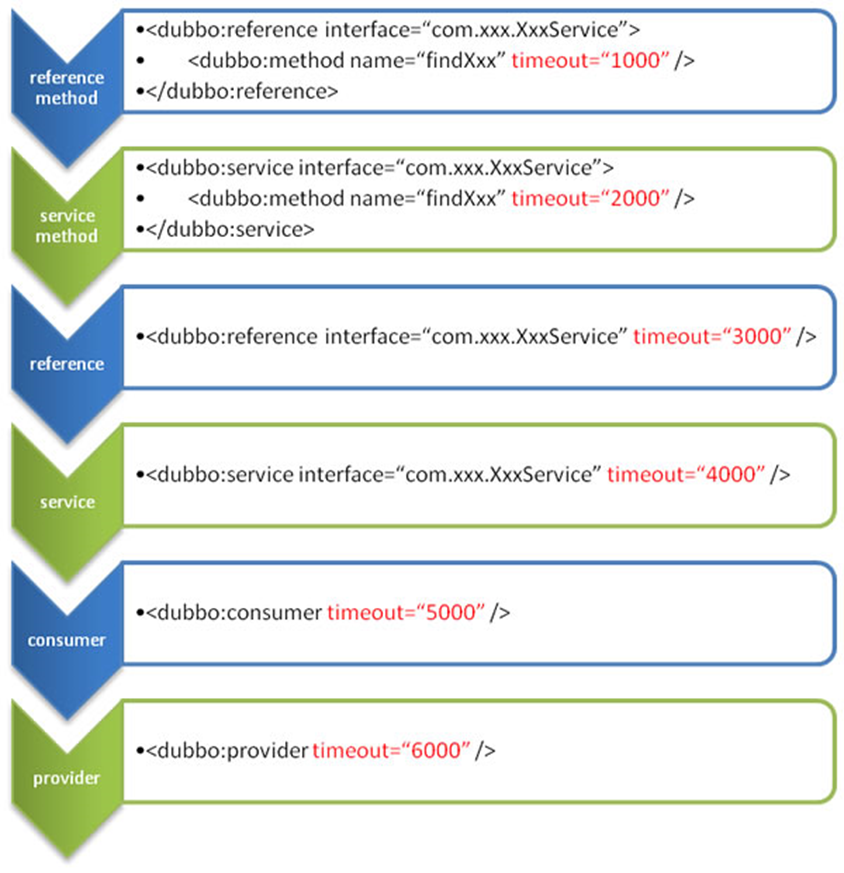

# Dubbo

# 1.分布式简要说明

**Dubbo是用于分布式系统的框架所以我们要先了解什么是分布式**

分布式系统是若干独立 计算机的集合，这些计算机对于用户来说就像单个相关系统。

## 1.1 Dubbo和SpringCloud对比


## 1.2 发展的演变


ORM**单一应用架构**：一个项目装到一个服务器当中，也可以运行多个服务器每一个服务器当中都装一个项目。

**MVC垂直应用架构**：将应用切割成几个互不相干的小应用，在将每个小应用独立放到一个服务器上，如果哪一个应用的访问数量多就多加几台服务器。

**RPC分布式应用架构(远程过程调用)**：当垂直应用越来越多，应用之间交互不可避免，将核心业务抽取出来，作为独立的服务，逐渐形成稳定的服务中心，使前端应用能更快速的响应多变的市场需求。

**SOA流动计算架构**：在分布式应用架构的基础上增加了一个**调度、治理中心**基于访问压力实时管理集群容量、提高集群的利用率，用于提高机器利用率的 资源调度和治理中心(SOA) 是关键 **(不浪费计算机资源)**

## 1.3 什么是RPC

**RPC（Remote Procedure Call）—远程过程调用**，它是一种通过网络从远程计算机程序上请求服务，而不需要了解底层网络技术的协议。即程序员无论是调用本地的还是远程的函数，本质上编写的调用代码基本相同。

### 1.3.1 RPC基本原理


两个核心模块：通讯、序列化。

# 2. Dubbo核心概念

Dubbo 是一款高性能、轻量级的开源Java RPC框架，它提供了三大核心能力：面向接口的远程方法调用，智能容错和负载均衡，服务自动注册和发现。分布式系统是将一个系统拆分为多个不同的服务

## 2.1 Dubbo特性


## 2.2 dibbo设计架构


1.  resistry注册中心

2.  provider服务提供者

3.  consumer服务消费者

4.  container是dubbo框架容器

5.  monitor监控中心

启动流程：

*   初始化：容器启动→服务提供者把提供的服务提交到注册中心→消费者去服务中心订阅

*   服务调用时的信息会异步发送给监控中心

## 2.3 环境搭建-zookeeper注册中心

## 2.4 环境搭建-管理控制台


# 3.Dubbo-Helloworld

## 3.1 需求

某个大型分布式系统，A服务需要调用B服务来获取数据。

这里我们需要三个模块，一个为A服务的业务模块，一个为B服务的业务模块，还有一个是公共的接口模块。AB都需要导入接口模块。

```xml
<dependency>
    <groupId>com.yxz.gmal</groupId>
    <artifactId>gmal-interface</artifactId>
    <version>0.0.1-SNAPSHOT</version>
</dependency>
```


## 3.2 xml配置法

服务提供方

```xml
<!--1.指定当前服务的名字-->
<dubbo:application name="user-service-provider"></dubbo:application>

<!--2.指定注册中心的位置-->
<dubbo:registry address="zookeeper://192.168.20.128:2181"></dubbo:registry>

<!--3.指定通信规则 （协议，端口）-->
<dubbo:protocol name="dubbo" port="20880"></dubbo:protocol>
<!--4.暴露服务 ref执行真正的实现对象-->
<dubbo:service interface="com.yxz.gmalinterface.service.UserService" ref="userServiceImpl"></dubbo:service>

<!--监控中心，register表示自己发现-->
<dubbo:monitor protocol="registry"></dubbo:monitor>
<!--注册对象，也可以直接用springboot的注解导入-->
<bean id="userServiceImpl" class="com.yxz.gmall.service.impl.UserServiceImpl"></bean>
```

消费者方

```xml
<dubbo:application name="order-service-consumer"></dubbo:application>

<dubbo:registry address="zookeeper://192.168.20.128:2181"></dubbo:registry>

<dubbo:reference id="userService" interface="com.yxz.gmalinterface.service.UserService"></dubbo:reference>

<!--监控中心-->
<dubbo:monitor protocol="registry"></dubbo:monitor>
```

# 4 整合springboot

## 4.1引入pom依赖

```xml
<dependency>
    <groupId>com.alibaba.boot</groupId>
    <artifactId>dubbo-spring-boot-starter</artifactId>
    <version>0.2.0</version>
</dependency>
```

## 4.2 配置yml文件

### 服务提供方

```yaml
dubbo:
  application:
    name: user-service-provider
  registry:
    address: zookeeper://192.168.20.128:2181
  protocol:
    name: dubbo
    port: 20880
  monitor:
    protocol: registry
```

### 服务消费方

```yaml
dubbo:
  application:
    name: order-service-consumer
  registry:
    address: zookeeper://192.168.20.128:2181
  monitor:
    protocol: registry
server:
  port: 8081

```

## 4.3 业务类注解

### 服务提供方

在类上添加 `com.alibaba.dubbo.config.annotaion.Service`的配置注解

```java
import com.alibaba.dubbo.config.annotation.Service;
/**
 * 1.将服务注册到注册中心
 *  1）导入dubbo依赖\zookeeper依赖 curator
 *  2）配置服务提供者
 *
 * 2.让消费者去注册中心订阅服务
 */
@Component
@Service
public class UserServiceImpl implements UserService {
    @Override
    public List<UserAddress> getUserAddressList(String userId) {
        System.out.println("3号被调用");
        UserAddress address1 = new UserAddress(1, "地址1", "1", "姓名1", "135123456", "Y");
        UserAddress address2 = new UserAddress(2, "地址2", "1", "姓名2", "135123456", "F");
        return Arrays.asList(address1,address2);
    }
}

```

### 服务消费方

用`Reference`导入需要引用的类即可

```java
import com.alibaba.dubbo.config.annotation.Reference;
import com.yxz.gmalinterface.bean.UserAddress;
import com.yxz.gmalinterface.service.OrderService;
import com.yxz.gmalinterface.service.UserService;
import org.springframework.stereotype.Service;

import java.util.List;


@Service
public class OrderServiceImpl implements OrderService {

    @Reference(timeout = 5000, loadbalance = "random")
    UserService userService;

    @Override
    public List<UserAddress> initOrder(String userId) {
        System.out.println("init函数");

        //1.查询用户的收货地址
        List<UserAddress> addressList = userService.getUserAddressList(userId);
        return addressList;
    }
}
```

# 5.配置信息

## 5.1 配置优先级


JVM 启动 -D 参数优先，这样可以使用户在部署和启动时进行参数重写，比如在启动时需改变协议的端口。

XML 次之，如果在 XML 中有配置，则 dubbo.properties 中的相应配置项无效。

Properties 最后，相当于缺省值，只有 XML 没有配置时，dubbo.properties 的相应配置项才会生效，通常用于共享公共配置，比如应用名。

## 5.2 重试与超时

失败自动切换，当出现失败，重试其它服务器，但重试会带来更长延迟。可通过 retries="2" 来设置重试次数(不含第一次)。

由于网络或服务端不可靠，会导致调用出现一种不确定的中间状态（超时）。为了避免超时导致客户端资源（线程）挂起耗尽，必须设置超时时间。

## 5.3 配置原则

dubbo推荐在Provider上尽量多配置Consumer端属性：

1、作服务的提供者，比服务使用方更清楚服务性能参数，如调用的超时时间，合理的重试次数，等等

2、在Provider配置后，Consumer不配置则会使用Provider的配置值，即Provider配置可以作为Consumer的缺省值。否则，Consumer会使用Consumer端的全局设置，这对于Provider不可控的，并且往往是不合理的

配置的覆盖规则：

1\) 方法级配置别优于接口级别，即小Scope优先

2\) Consumer端配置 优于 Provider配置 优于 全局配置，

3\) 最后是Dubbo Hard Code的配置值（见配置文档）


